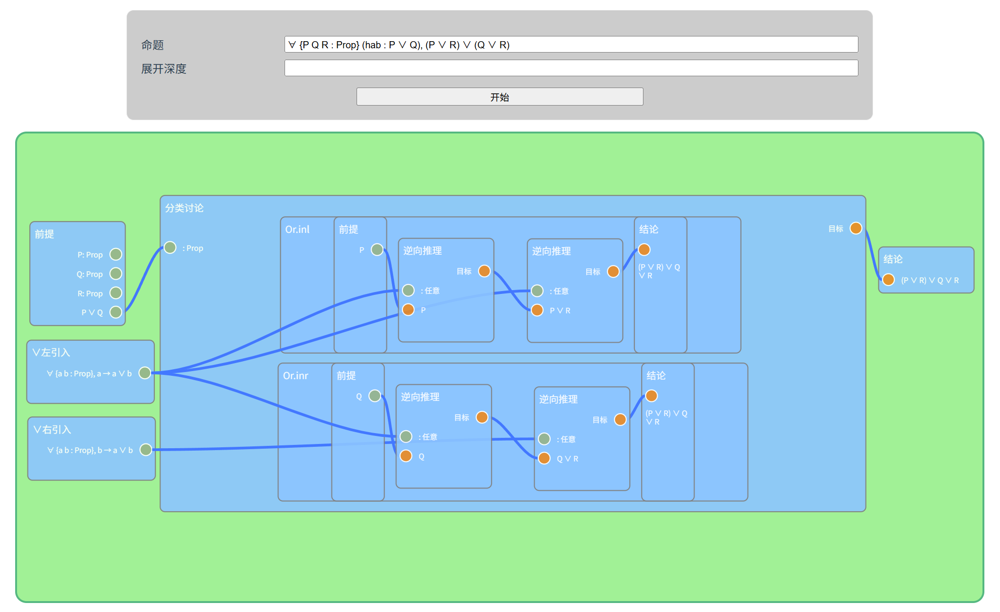
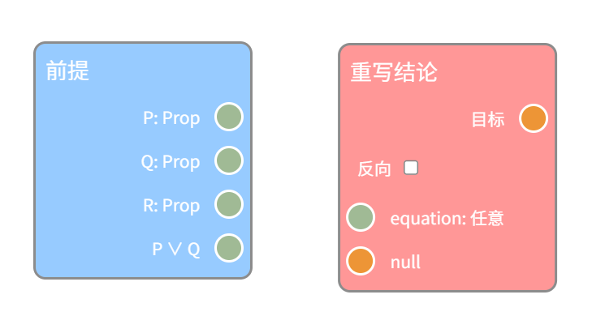
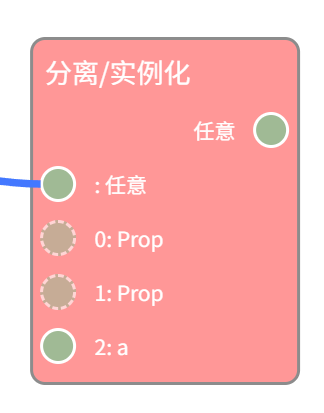
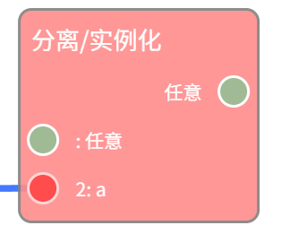
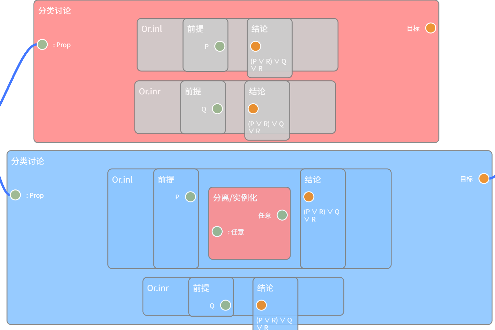

# 快速入门

## 总览

Leanclient 的界面上方是命题编写区，下方是证明区。通过在证明区添加节点与连接，尝试完成证明！完成证明后，证明区的背景会变为绿色。

## 节点与连接

每次开始证明时，证明区将自动出现两个节点：前提与结论。证明的目标就是构造一张连接前提与结论的合法的图。

可以通过右键打开节点列表新增节点。

节点分为有效和无效两种状态，分别显示为蓝色和红色。无效节点意味着节点的连接不当（缺少连接、错误连接），需要修正。另有些节点会显示为灰色，表示这一节点未被计算，见下文“子节点”。

节点的接口在左右两侧各有一排，分为绿橙两种颜色：
- 绿色：**值接口**，在左侧的值接口只显示**名称与类型**，接受一个输入的对应类型的值；在右侧的值接口只显示**值与类型**（命题的证明项只显示**类型**），代表节点输出的一个值。
- 橙色：**目标接口**，代表一个待证明的命题。与值接口相反，在右侧的目标接口接受另一个目标的输入，没有类型；而在左侧的目标接口表示节点新增的待证明的目标，显示其**类型**。

所有的连接只能从值接口连向值接口，或从目标接口连向目标接口，或从值接口连向目标接口（代表提供目标的证明）。从目标接口连向值接口的连接是不合法的。一个值输出接口能够有多个连接，而所有其他接口只能有**至多一个连接**。

部分值接口是虚线边框，表示如果不提供输入，将会由程序尝试自动推断。

> 出于技术原因，部分目标接口即使不提供输入，也会被程序自动推断。

有时候，你会看到显示为红色的接口，这表示接口由于节点的变化已经不再被使用，如果删去该接口上的所有连接，这个接口也会被删除。

## 子节点

有些节点可以包含子节点。通过长按一个节点、拖动到可以包含子节点的节点上方并松开就可以将其添加为该节点的子节点。

子节点有特殊的连接规则：所有的连接只能由**更外层的节点连入子节点**，而不能**从子节点连向外层**。

通常只有当父节点有效，子节点才会被计算。因此，有时子节点会显示为灰色，意味着由于父节点失效，子节点未被计算（于是也无法判断是否有效）。

## 命题编写

### 命题

命题需要以[Lean 依值类型论](tutorials.md)的语法编写。以下是几个合法的命题的例子：
- `∀ (P : Type → Prop) (Q : Prop), (∀ (x : Type), P x → Q) → (∃ (x : Type), P x) → Q`
- `∀ {P Q R : Prop} (hab : P ∨ Q), (P ∨ R) ∨ (Q ∨ R)`
- `{P Q : Prop} → (P → Q ↔ ¬ P ∨ Q)`

### 展开深度

默认情况下，Leanclient 会将所有的蕴含前件以及全称量词约束的变元都加入前提。如果这不是你期望的行为，可以指定加入前提的个数。

## 进一步阅读

[依值类型论中的证明](tutorials.md)