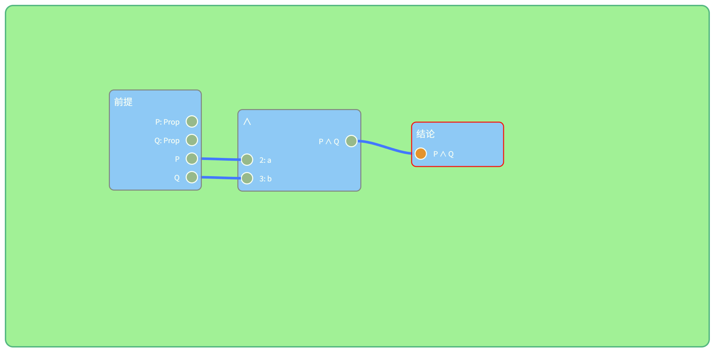
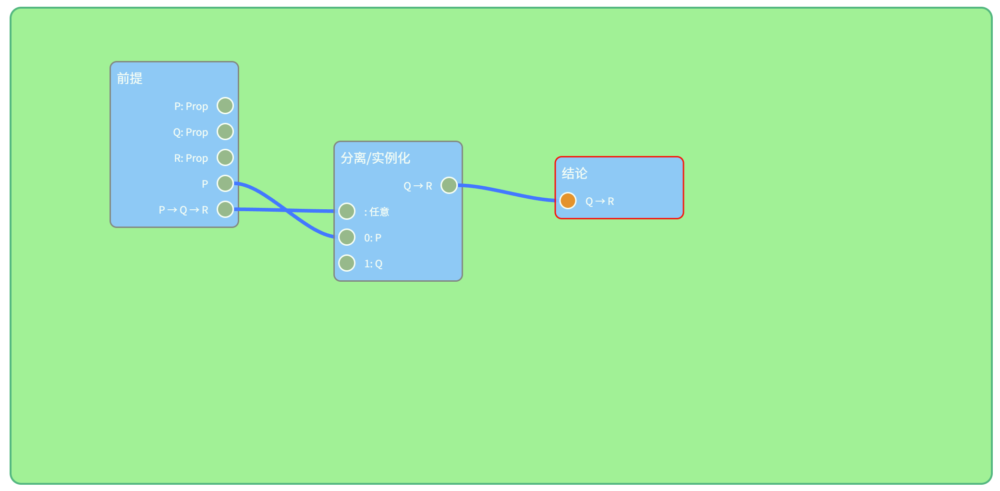
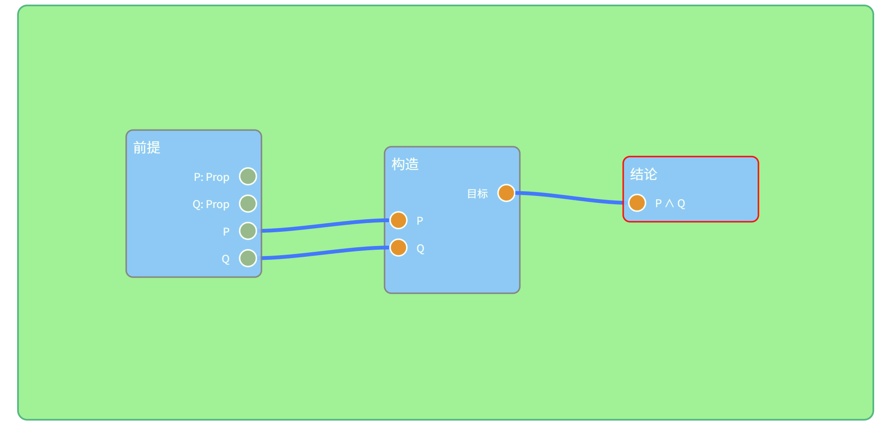
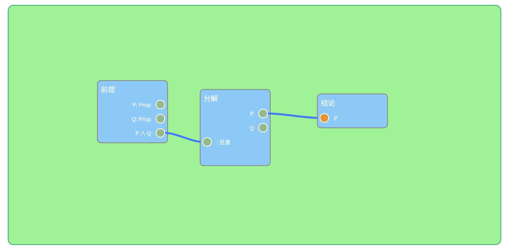
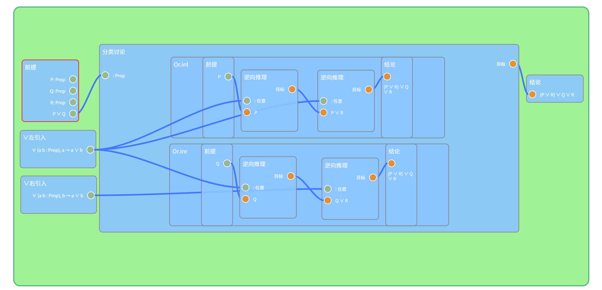

# 依值类型论中的证明

> *命题即类型，证明即程序。*
> *——柯里-霍华德同构*

## 简介

Leanclient 是基于 Lean 的实现，因此继承了 Lean 的依值类型论。这个文件将简要通俗地解释 Lean 依值类型论的一些内容。

在多数现代语言中，每个变量都有个“类型”。比如 `x : Nat` 表示 x 是个自然数，`s: String` 表示 s 是个字符串。

在依值类型论里，我们把数学命题也看作一种**类型**。

- 命题 “1 + 1 = 2” 是一个**类型**。
- 命题 “存在一个偶数” 也是一个**类型**。
- 命题 “对于所有自然数 n，n + 0 = n” 同样是一个**类型**。

那么，这个类型的“值”是什么呢？就是它的**证明**！一个命题为**真**，**当且仅当**存在一个对应类型的值；在依值类型论框架下证明一个命题，就是构造一个该类型的“值”或“程序”。

上图中，我们将一个 P 的证明和一个 Q 的证明，通过合取的引入规则构造出了一个 P ∧ Q 的证明。

**注意区分命题本身和命题的证明**：你可能注意到，上图的前提中除了 P 与 Q，还有 P : Prop 和 Q : Prop，它们有什么区别吗？其实，命题也有类型，为 `Prop`，因此 P : Prop 和 Q : Prop 表示定义了两个**命题** P 和 Q，而后面的 P 和 Q 分别表示 P 和 Q 的**证明**。两个证明项不注明值是因为：1. 证明是一段程序，它很难用简短的符号表示；2. 一个命题的任意证明之间都是彼此等价的，我们不关心证明具体怎么构造，只关心它是否**存在**。

> 事实上，依值类型论中的一切表达式均有类型：Prop 的类型是 Sort 1，Sort 1 的类型是 Sort 2，等等；一般值的类型如 Nat 的类型为 Type，Type 的类型为 Type 1，等等。

## 函数、依值类型、蕴含与全称量词

在依值类型论中，函数的类型基本沿用了集合论中映射的记号：对于一个输入参数类型为 A 和 B，输出类型为 C 的函数，类型记为 `A → B → C`。在 Leanclient 中，`基本推理规则->分离/实例化`就是一般的函数赋值工具。

函数符号与数理逻辑中“蕴含”的符号一样，这不是巧合：如果 A、B 是命题，存在一个类型为 `A → B` 的函数 f，那么假如存在一个 A 的证明 `a : A`，我将 a 赋值给 f 立刻得到一个类型为 B 的项，就是 **B的证明**！因此，前件为真立刻可以得到后件为真，这和**蕴含**的含义是一致的！

函数可以被部分赋值（柯里化）：如下图在前提为 P 和 P → Q → R 的条件下证明 Q → R，只需要对**类型**为 P → Q → R 的函数赋值**类型**为 P 的值，就能得到**类型**为 Q → R 的函数，即为 Q → R 的**证明**。

依值类型论中“**依值**”的含义是类型可以是一个**赋值后的函数**，参数不同，表示的类型也不同。如上述的 P ∧ Q 实际上是 `And P Q` 的记号，它是 `And : Prop → Prop → Prop` 用 P 和 Q 赋值的结果。函数的返回值也可以依赖函数的参数，如存在 `Exists : (α : Sort u) → (α → Prop) → Prop` 用函数的输入**值** α 作为第二个参数类型的一部分。

在依值类型论中，**全称量词**和一个返回值**类型**为辖域命题的依值**函数**是等价的，因为任意赋值函数的参数，都会给出一个返回值，即辖域命题的证明。

实际上，Leanclient 在生成题目的时候并不区分前提和结论，上面的两个例子实际上证明的都是函数类型的“命题”，其类型可以分别记为
- `∀ (P Q : Prop), P → Q → P ∧ Q`
- `∀ (P Q R : Prop), P → (P → Q → R) → Q → R`

就像在编程中一样，诸如 `P Q : Prop` 的定义是必要的，否则 Lean 无法得知 P 或 Q 是什么类型的值。

## 构造、分解、分类讨论、归纳类型

就像C++中类的构造器一样，Lean 中的很多类型也有构造器，告诉我们怎么构造一个对应类型的值。在上面的第一个例子中，我们就使用了合取的构造器（`合取->引入`）构造了一个合取。

构造器可能只有一个，也可能有多个，甚至可能不存在，这主要取决于有**多少种方式**构造一个对应类型。比如合取必须提供左右两个命题的证明，真（`True`）的构造器不需要参数就会给出证明（因此它永远是真的），存在需要提供一个特定的个体 x 以及 P x 的证明，它们都只有一个构造器；析取可以是左侧为真（`析取->左引入`）也可以是右侧为真（`析取->右引入`），因此有两个构造器；假（`False`）永远不可能为真，因此它没有构造器。

对于只拥有一个构造器的类型（如合取、真、存在等），Leanclient 提供了 `基本推理规则->构造` 这一一般性的工具进行构造。第一个例子也可以如下方式证明：

反过来，我们也可以通过类型的构造器，从某类型的值拆出其中的各个构造参数。

对于只有一个构造器的类型，Leanclient 提供了 `基本推理规则->分解`。

> 出于一些技术原因，对于依值的构造函数，`基本推理规则->分解`无法正确运行。如 Exists 虽然只有一个构造器 `Exists.intro : ∀ (w : α), p w → Exists p`（省略了部分隐式参数），但由于显式参数 p w 依赖前一个参数 w，目前无法将它分解。Leanclient 提供了 `量词->存在量词消去` 处理存在的分解，对于其他有类似情况的类型，请使用`分类讨论`。

下例展示如何使用分解从 P ∧ Q 证明 P。 

对于有多个构造器的类型，因为我们**无法知道**究竟是通过哪个构造器构造的，因此必须**对每种情况都构造一个证明项**，即**分类讨论**。在 Leanclient 中，这需要使用 `基本推理规则->分类讨论->分类讨论`。考虑如下从 P ∨ Q 证明 (P ∨ R) ∨ (Q ∨ R) 的例子：

> 在上述例子中，我们使用了`分离/实例化`的反向推理版本，这一节点的优势在于可以从证明目标自动推断需要填充的类型。

有一种特殊但常用的分类讨论：`基本推理规则->分类讨论->真假二分`，按照一个**命题**的真假进行分类，这实际上是对排中律 `em : P ∨ ¬P` 进行了分类讨论。需要注意的是，真假二分的输入是**命题**而非命题的**证明**

另外，Lean 中还有一种具有特殊构造器的类型，称为归纳类型。这种类型通常有一个构造器以这个类型本身作为参数。如自然数 `Nat` 有两个构造器：`Nat.zero : Nat` 构造 0，而`Nat.succ : Nat → Nat`接受一个自然数并给出这个自然数的后继。

> 归纳类型的定义事实上比这个更广，比如所有具有多个构造器的类型都为归纳类型。但我们的确更关心上面这一种特定的归纳类型。

## 相等、双蕴含、重写

相等（`Eq`）是一种很特殊的类型，它只有一个构造器 `Eq.refl : ∀ {α : Sort u_1} (a : α), a = a`。所有的相等关系，原则上都来自于这一构造器。虽然并不显然，一些重要的定理如等量代换定理都是这一构造器在归纳意义下的推论。（参见[归纳类型](https://www.leanprover.cn/tp-lean-zh/inductive_types.html)）

等量代换定理的类型为 `∀ {α : Sort u} {motive : α → Prop} {a b : α}, a = b → motive a → motive b`，简而言之如果 a = b，就可以将一个类型为 motive a 的值的**类型**替换为 motive b。

Leanclient 提供了`基本推理规则->重写`进行类型的替换。

另外，**命题外延公理**（`∀ {a b : Prop}, (a ↔ b) → a = b`）告诉我们双蕴含与相等之间的等价关系，因此同样可以使用双蕴含进行重写。

## 参考资料

对于更详细、严谨的 Lean 依值类型论中证明的讨论，参见[Lean 4 定理证明](https://www.leanprover.cn/tp-lean-zh/title_page.html)。